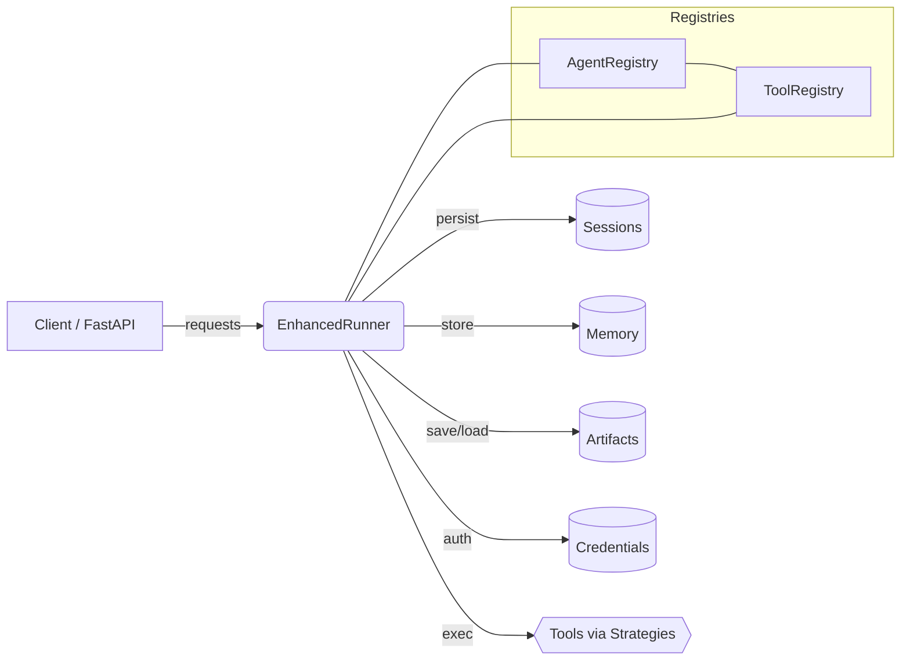

# Google ADK Extras

Production-ready extensions for Google ADK: robust services (sessions, memory, artifacts), credential services, an enhanced runner, registries, and a clean FastAPI integration for deployment.

Why this package?

- Custom service implementations with multiple backends (SQL, MongoDB, Redis, S3, YAML)
- Credential services (OAuth2 providers, JWT, Basic) that plug into ADK
- Enhanced Runner with YAML-driven configuration, retries, circuit breakers, and rich errors
- Agent and Tool registries with health monitoring, caching, and events
- Enhanced FastAPI app/server that cleanly supports custom credential services

Quick links

- Get Started → Installation and Quickstarts
- Concepts → Runner, Services, Registries, Configuration
- How‑To → Credentials, Storage, FastAPI, Tool Strategies, Error Handling
- Tutorials → End‑to‑end scenarios (OAuth app, YAML runtime, OpenAPI tools, deploy)
- Reference → API, configuration, URIs, errors

Compatibility

- Python 3.12+
- Works with Google ADK; install extras for chosen backends as needed
